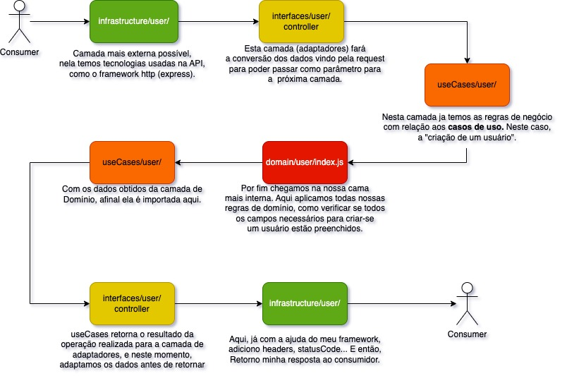
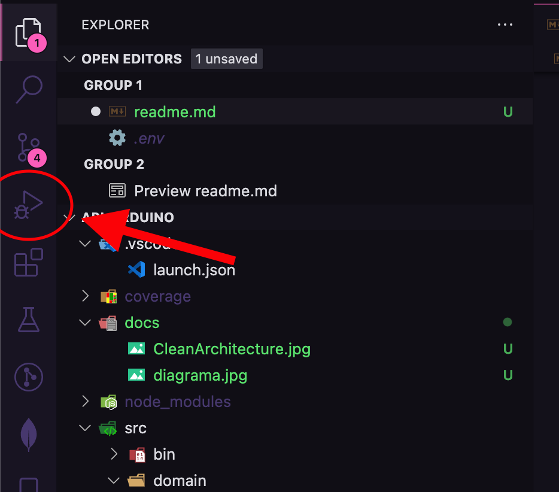
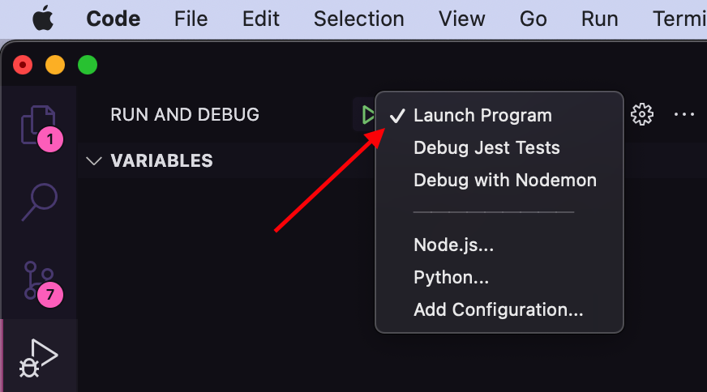

# Arduino-api

Esse projeto consiste em uma simples api REST para registro de usuário, mas  ela tem algo diferente, para ser exatao duas coisas:

 - Primeiro: Ela foi feita utilizando os conceitos de arquitetura limpa do livro "Arquitetura Limpa" de Uncle Bob.
 - Segundo: Ainda não está implementado mas... Essa API será consumida por um Arduino. Explicarei mais à frente. 
## Visão Geral

Consite em uma API que basicamente vai fazer o registro de usuários, tendo  4 rotas:
- **POST /user** - Rota responsável por criar usuário e salvar no banco de dados (finalizada)
- **GET /user** - Rota responsável por listar todos os usuários (Work in Progress)
- **DELETE /user** - Rota responsável por deletar um usuário (Work in Progress)
- **PUT /user** = Rota responsável por alterar dados de um usuário (Work in Progress)

Como dito anteriormente, apesar de se tratar de um projeto simples, o intuito dele é focar na arquitetura limpa. Quando tratamos uma API com estes conceitos, trabalhamos nela em "camadas". Segue imagem que melhor explica este conceito:  

Bem resumidamente quando estamos falando de uma API construída com base nos conceitos do Uncle Bob, quando mais interna é nossa camada, mais abstrata ela é. O que isso significa? Significa que nossas camadas mais internas "não quer nem saber" qual framework estou utilizando para tratar mihas requisições http, ou, qual banco de dados eu estou utilizando... São simplesmente arquivos que contém classes, funções que recebem seus parâmetros, e aplicam a lógica neles. Este é o conceito de inversão de dependência, ou seja, as camadas não dependem das camadas mais externas do que ela, apenas das mais internas. Por exemplo: Use Cases não depende da camada de Adaptadores, contudo, depende diretamente da camada de Entidadades.

Agora vamos ver o fluxo de dados dentro da nossa API, para isso vou user a rota de criação de usuário. 

É claro que esta é uma visão de um maneira geral. Utilizamos outros adapatadores como por exemplo para acesso ao Banco de Dados, para realizar o callback do nosso framework (Express). Mas de uma maneira resumida, nossa estrutura de dados dentro da API ocorre como na imagem acima. Para melhor compressão, recomendo que clone o serviço no seu PC e realize o debug, seguindo as intruçoes de instalação.

## Variáveis de Ambiente

Para rodar este projeto, você vai precisar das seguintes variáveis de ambiente: 
`USER_DB_URL`: Url de conexão com o banco de dados. (No meu caso utlizei o mongodb atlas). 
`USER_DB_NAME`: Nome da instância do banco de dados que criar.

## Como rodar localmente
Para rodar o serviço localmente siga os passos a seguir: 
1. Clone o repositório com `git clone https://github.com/janderteodoro/Arduino-api.git` no terminal;
2. Crie um arquivo `.env` na raiz do projeto com as variáveis acima;
3. Verifique se está com uma versão recente do node.js (16>=) utilizando o comando `nvm ls` no terminal;
4. Instale as dependências do projeto com `npm install`;
5. Após instalar todas as dependências vai na  área de **debug** do seu vscode: 
 
6. Crie um launch.json do tipo **node.js**
7. Selecione **"Launch Program"** e inicie o processo de debug adicionando brake points 
 

Caso não consiga entender o processo de debug ou queira se aprofundar no assunto, recomendo que leia a [documentação oficial](https://code.visualstudio.com/docs/editor/debugging) da ferramenta.

## Próximos passos
* Concluir as rotas relacionadas ao usuário (GET, DELETE e PUT)
* Realizar esquema elétrico do arduino

# Referência

 - 📚 [Arquitetura Limpa](https://www.amazon.com.br/Arquitetura-Limpa-Artes%C3%A3o-Estrutura-Software/dp/8550804606) - Robert C. Martin
 - 📚 [Arquitetura Limpa na Prática](https://www.otaviolemos.com.br/) - Otávio Lemos

 
